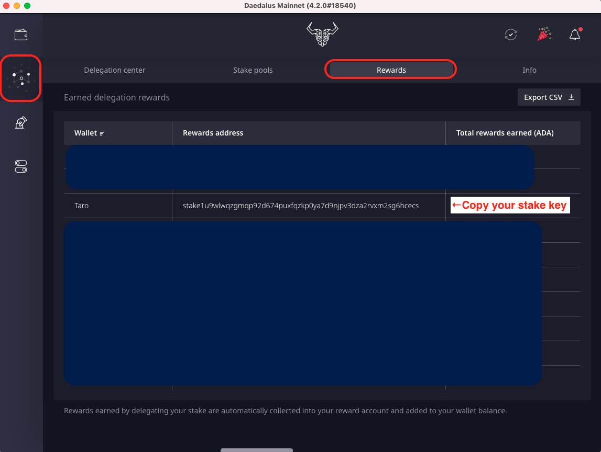
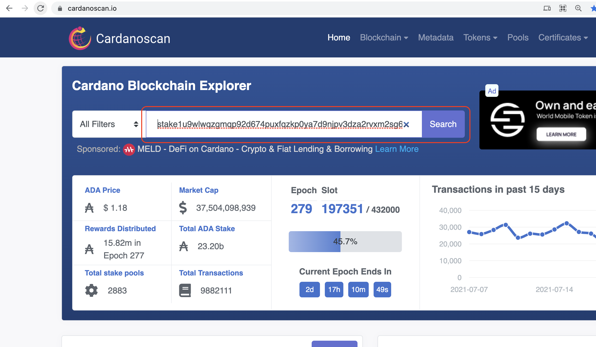
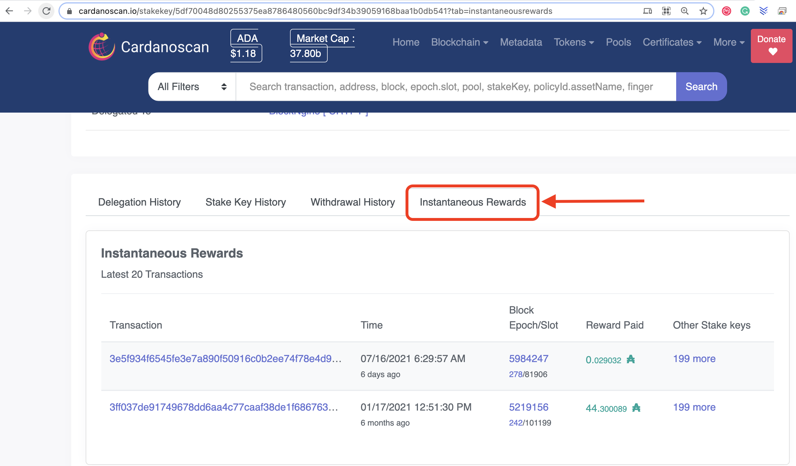
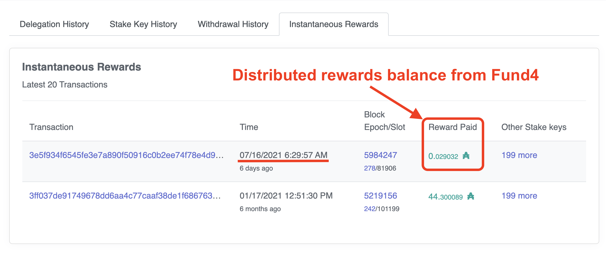

# Check Rewards Earned

The following helps you with checking any rewards earned from Project Catalyst.

\
1\. Open the **Rewards** tab in Daedalus and copy your stake key.

2\. Open [**Cardanoscan**](https://cardanoscan.io) **** and paste your stake key and click **Search**

3\. Click **Instantaneous Rewards**

4\. You can see the latest distributed rewards balance here:

